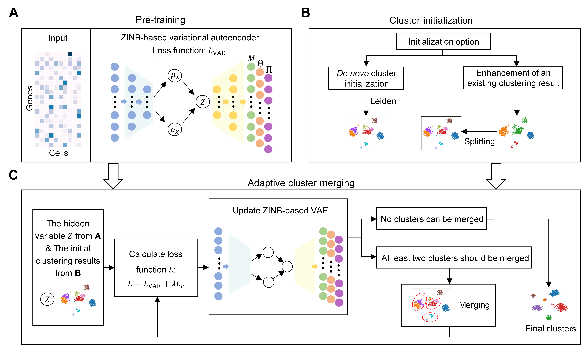

# scAce: an adaptive embedding and clustering method for scRNA-seq data

## Overview



scAce is consisted of three major steps, a pre-training step based on a variational autoencoder, a cluster initialization step to obtain initial cluster labels, and an adaptive cluster merging step to iteratively
update cluster labels and cell embeddings. In the pre-training step, scAce takes the single-cell gene expression matrix as its input to train a VAE network. For each gene, the VAE learns and outputs three parameters of a ZINB distribution (mean, dispersion, and proportion of zero). In the cluster initialization step, scAce offeres two manners. With *de novo* initialization, Leiden is used to obtain initial cluster labels; with clustering enhancement, initial cluster labels are obtained by applying a cluster splitting approach to a set of existing clustering results. In the adaptive cluster merging step,  given the pre-trained VAE network and the initial cluster labels, the network parameters, cell embeddings, cluster labels and centroids are iteratively updated by alternately performing network update and cluster merging steps. The final results of cell embeddings and cluster labels are output by scAce after the iteration process stops.

## Installation

Please install `scAce` from pypi with:

```shell
pip install scace
```
Or clone this repository and use

```shell
pip install -e .
```
in the root of this repository.
## Quick start

Load the data to be analyzed:

```python
import scanpy as sc

adata = sc.AnnData(data)
```

Perform data pre-processing:

```python
# Basic filtering
sc.pp.filter_genes(adata, min_cells=3)
sc.pp.filter_cells(adata, min_genes=200)

adata.raw = adata.copy()

# Total-count normlize, logarithmize and scale the data  
sc.pp.normalize_per_cell(adata)
adata.obs['scale_factor'] = adata.obs.n_counts / adata.obs.n_counts.median()

sc.pp.log1p(adata)
sc.pp.scale(adata)
```

Run the scAce method:

```python
from scace import run_scace
adata = run_scace(adata)
```

The output adata contains cluster labels in `adata.obs['scace_cluster']` and the cell embeddings in `adata.obsm['scace_emb']`. The embeddings can be used as input of other downstream analyses.

<ins>Please refer to `tutorial.ipynb` for a detailed description of scAce's usage.<ins>

